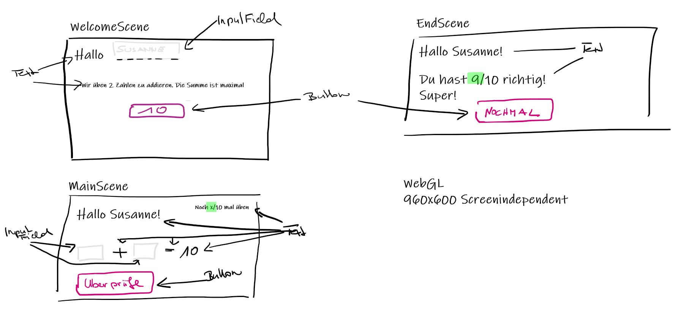

# Kinderrechner: 2 Zahlen addieren

### Project description: 
This project serves to visualize the process for the implementation of a microgame. We use git / GitHub not only for version control, but also to display the individual tasks (see Projects pane) and for feedback (see Issues pane). Please follow the individual cards in the Projects pane step by step to identify comprehension problems. Write down what your problem is and try 2 ways to solve it yourself. 

DE: Aufgabenstellung

Anforderung: Eine Freundin möchte für ihre Tochter (Volksschule) ein web-basiertes Spiel zum Addieren-Üben von zwei Zahlen. 

Die Aufgabe besteht darin, anhand dieser Anforderung ein Microgame für Browser (WebGL, 960x600) mit Unity 2D selbstständig zu erstellen. 
1) Konzept wurde schon erstellt, siehe Implementation Concept unten
2) Aufteilung des Projekts in Einzelschritte (für Programmierung mittels GitHub Projects). Hier im Template ist unter Projects ein Beispiel mit Beispielschritten angegeben. Bitte übernehmen oder selbst eigene Schritte anlegen. (Kann als Ganzes nicht kopiert werden, die Columns und Cards müssen selbstständig angelegt werden. Inhalte der Karten können kopiert werden. https://docs.github.com/en/issues/organizing-your-work-with-project-boards/managing-project-boards
3) Abarbeitung Einzelschritte (Umsetzung bis 14.6 **NICHT** erforderlich) 
4) Für Testen freigeben (Notiz im Readme) (Umsetzung bis 14.6 **NICHT** erforderlich)

### Development platform: 
(OS, Unity Version, Visual Studio Version, used SDKs)
Windows 10, Unity 2020.1.5f1, Visual Studio 2019

### Target platform: 
WebGL 960x600 reference resolution 

### Implementation Concept:

### Necessary setup/execution steps: 
Installation process, e.g. step by step instructions that I can run the project after cloning it

### Third party material: 
(if used Fonts, Sounds, Music, Graphics, Materials, Code etc.)

### Project state: 
incl. progress in percent

### Limitations: 

### Lessons Learned: 

Copyright by smeerws
